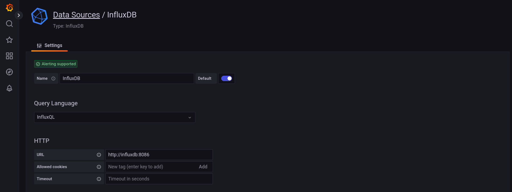

# k6-CI

# How to test?
1. Create test-scripts in `scripts` directory
2. Bootstrap influxDB and grafana
```bash
make bootstrap
```
3. Then run
```bash
make k6-test test={{name-of-the-test-in-**scripts**-directory}}
```
> Eg: 
```bash
make k6-test test=concreteAI
```
4. Open grafana UI at http://localhost:3000

5. Configure **Data Sources / InfluxDB**
- Change the url to `http://influxdb:8086`
- Set the name of database to `k6`
> You can see this name in `docker-compose` file:
```js
...
- INFLUXDB_DB=k6`
...
```




6. Import Dashboard, you can use the `dashboard-template.json` sample 
in the `asserts/samples` directory


7. And chose default InfluxDB


8. The result likes this:


> Note: Please check the time range before analysis. \
> Please check the DB's name


### Some useful commands:
1. `make clean`
2. `make clean_all`
3. `make test` with the default test script: concreteAI.js


